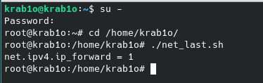
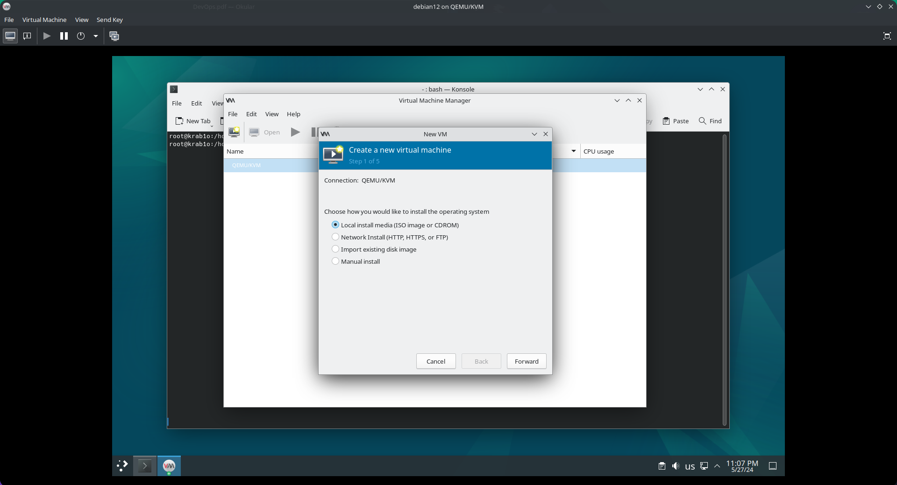
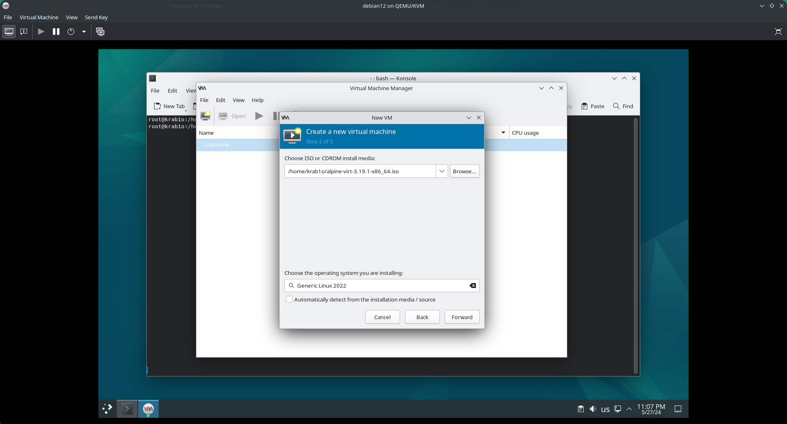
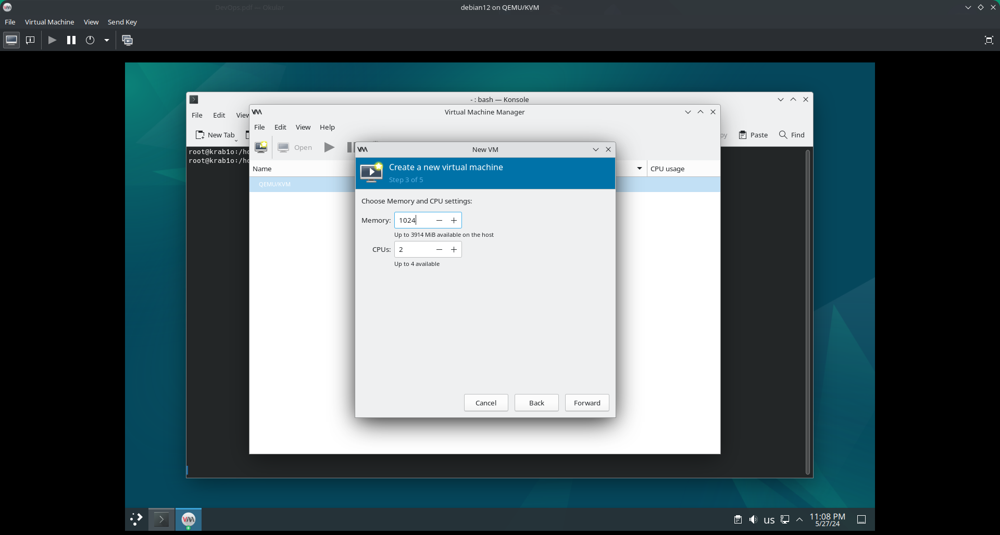
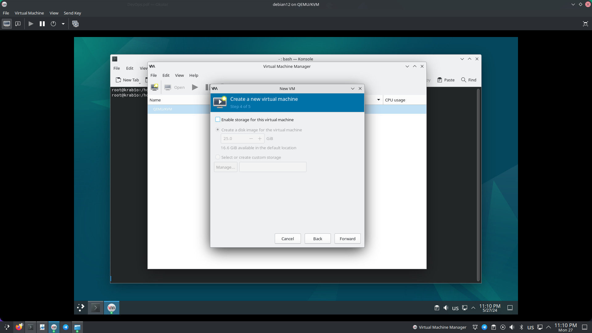
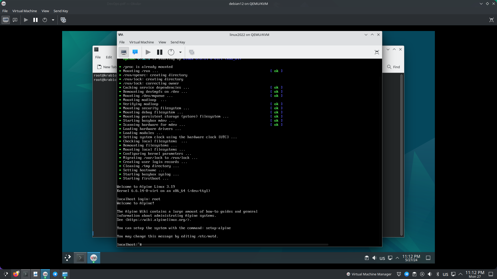

# Описание выполнения задания

В начале выполняется скрипт, создающий необходимую топологию сети, кроме виртуальной машины (vh, kvm). Как я понял, её мы должны будем создать во втором задании.

Запускаем скрипт (также лежит в папке под именем net.sh):



Также мы вручную присваиваем IP-адрес bridge br1 с помощью следующей команды (присваивание широковещательного адреса необязательно):

```
ip addr add 30.0.0.1/24 dev br1 brd 30.0.0.255
```

Далее происходит процесс создания виртуальной машины с помощью virt-manager (GUI), в конце указывается br1 в Network секции.












Виртуальная машина создана. DHCP-сервер не сделал :/